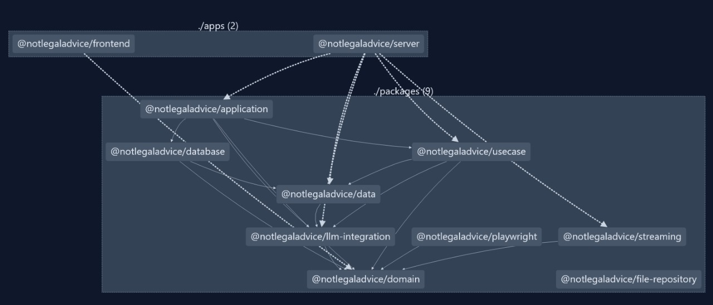

# Descripcion del proyecto

Aplicacion multiplataforma para la gestion de documentos legales integrada con un agente de inteligencia artificial capaz de extraer datos principales de los documentos y calcular metricas globales sobre la libreria.

# UI

# Grafo de dependencias

# Estructura de carpetas

- /apps = Todo lo relacionado a entrypoints de los paquetes del workspace @notlegaladvice
  - /apps/frontend = Frontend React Native **(AQUI SE ENCUENTRA EL CONTENIDO PRINCIPAL DE LA ENTREGA 1, TODO LO DEMAS ES PRINCIPALMENTE DE BACKEND)**
  - /apps/server = Backend Fastify
- /packages = Todo lo relacionado a dominio e integraciones
  - /packages/application = Capa de aplicacion (ubicacion del mecanismo de IoC)
  - /packages/data = Esquemas de datos y tipado relacionado a aspectos tecnicos o sistemas propios de la aplicacion
  - /packages/database = Integracion con base de datos (MongoDB)
  - /packages/file-repository = Integracion con base de datos orientada a adquisicion de datos binarios, en el futuro sera migrado a un almacenamiento de objetos (actualmente MongoDB, en un futuro posiblemente S3)
  - /packages/llm-integration = Integracion con LLM y LangChain
  - /packages/streaming = Abstraccion de streaming para gestion reactiva de los datos
  - /packages/usecase = Casos de uso de la aplicacion
  - /packages/domain = Dominio de la aplicacion

# Ejecucion en local

Se recomienda el uso de Nix como gestor de paquetes pues se cuenta con un flake que incluye las versiones esperadas del software y contiene un devShell completo con definicion de variables de entorno que son requeridas para la ejecucion del backend

## Ejecucion del backend

### Instrucciones de ejecucion

> Instalar dependencias (Opcional si ya se cuenta con Node 20.x y Corepack 20.x)
> `nix develop`

> Instalar dependencias de Node
> `npm install`

> Ejecutar la aplicacion (Para plataforma web)
> `npx nx run @notlegaladvice/server:serve`

### Stack tecnologico

- Libreria HTTP: Fastify
- Instrumentacion CI: Github Actions
- Instrumentacion CD: Podman y Kubernetes
- Testing: Jest
- Build system: NX
- Framework LLM: LangChain
- Integraciones: MongoDB y LightRAG

### Despliegue en K8s

#### Crear imagen (ejecutar desde el root del projecto de Git)

> podman build -t notlegaladvice-server:latest -f deployment/Dockerfile

#### Crear recursos de K8s

> kind load docker-image localhost/notlegaladvice-server:latest

> kubectl apply -f deployment/cluster/01-secrets.yaml # (Secretos de backend) 

> kubectl apply -f deployment/cluster/02-configmap.yaml # (Configmap de backend)

> kubectl apply -f deployment/cluster/03-otlp-collector-deployment.yaml # (Despliegue de Jaeger para OTLP)

> kubectl apply -f deployment/cluster/04-otlp-collector-service.yaml # (Servicio de Jaeger)

> kubectl apply -f deployment/cluster/05-application-deployment.yaml # (Despliegue de backend)

> kubectl apply -f deployment/cluster/06-application-service.yaml # (Servicio de backend)

> kubectl apply -f deployment/cluster/07-application-ingress.yaml # (Ingress de backend)

Despues de haber realizado el despliegue completo, el backend debe estar disponible en http://local.projectcontour.io:8081/

## Ejecucion del frontend

### Instrucciones de ejecucion

> Instalar dependencias (Opcional si ya se cuenta con Node 20.x y Corepack 20.x)
> `nix develop`

> Instalar dependencias de Node
> `npm install`

> Ejecutar la aplicacion (Para plataforma web)
> `npx nx run @notlegaladvice/frontend:serve`

Habiendo hecho esto el frontend deberia estar disponible en http://localhost:8081

### Stack tecnologico

- Libreria UI: React Native
- Metaframework TS (Sistema de efectos funcionales): EffectTS 
- Libreria para funcionalidades nativas: Expo
- Libreria para manejo de estado global: Zustand
